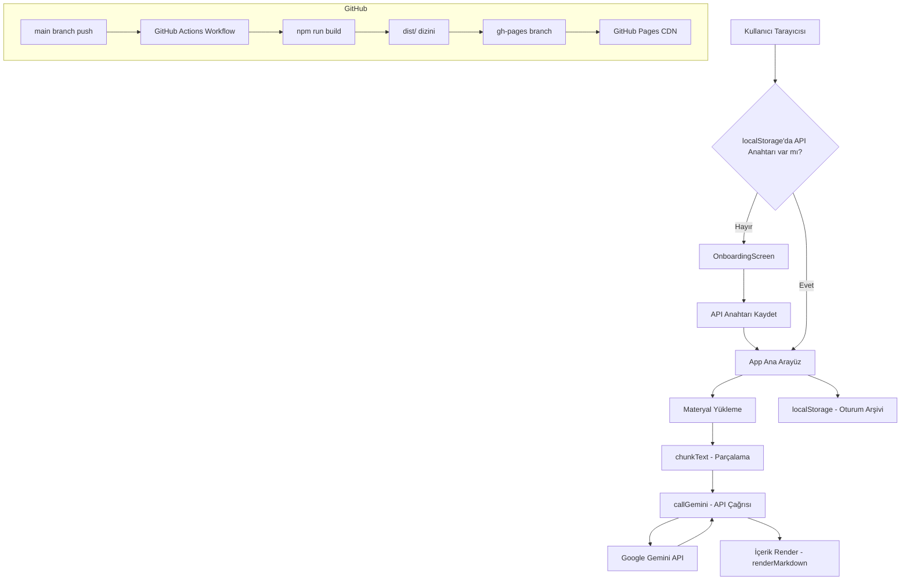

# Tasarım Belgesi: Akademik Asistan GitHub Pages Deploy

## Genel Bakış

Bu belge, mevcut tek dosyalık React uygulamasının (`yapay öğretmen kodu v7.txt`) Vite + React projesi olarak yeniden yapılandırılması ve GitHub Pages'e otomatik deploy edilmesi için teknik tasarımı tanımlar.

Uygulama tamamen istemci taraflı (client-side) çalışır; sunucu gerektirmez. Google Gemini API (gemini-2.0-flash, ücretsiz tier) ile AI içerik üretimi yapılır. API anahtarı kullanıcı tarafından sağlanır ve tarayıcının `localStorage`'ında saklanır.

### Temel Tasarım Kararları

- **Tek sayfa uygulaması (SPA)**: Tüm routing istemci taraflı; GitHub Pages için `404.html` fallback gerekmez çünkü hash-based routing kullanılmaz, uygulama tek sayfadır.
- **Sıfır backend**: Tüm veriler `localStorage`'da; API çağrıları doğrudan tarayıcıdan Gemini'ye gider.
- **Mevcut kodu koru**: `v7.txt` içindeki tüm mantık korunur, yalnızca modüler dosya yapısına taşınır.
- **Tailwind CSS v3**: PostCSS pipeline ile entegre edilir; CDN yerine yerel kurulum.

---

## Mimari



### Veri Akışı

1. Uygulama açılır → `localStorage`'dan API anahtarı okunur
2. Anahtar yoksa `OnboardingScreen` gösterilir
3. Materyal yüklenir → `chunkText()` ile parçalanır → `materialChunks` state'e kaydedilir
4. Kullanıcı içerik üretir → `callGemini()` çağrılır → yanıt `renderMarkdown()` ile gösterilir
5. Her state değişikliğinde `useEffect` → `localStorage`'a JSON olarak kaydedilir

---

## Bileşenler ve Arayüzler

### Dosya / Dizin Yapısı

```
akademik-asistan/
├── .github/
│   └── workflows/
│       └── deploy.yml          # GitHub Actions pipeline
├── public/
│   └── favicon.ico
├── src/
│   ├── main.jsx                # React DOM render giriş noktası
│   ├── App.jsx                 # Ana uygulama bileşeni (tüm state, tab yönetimi)
│   ├── components/
│   │   ├── OnboardingScreen.jsx  # API anahtarı giriş ekranı
│   │   └── VisualSummaryComponent.jsx  # Görsel özet renderer
│   └── utils/
│       ├── gemini.js           # callGemini, retry mantığı
│       ├── markdown.js         # renderMarkdown, formatInline, formatSubSup
│       ├── chunking.js         # chunkText
│       ├── quiz.js             # parseJSON, isAnswerCorrect
│       ├── sound.js            # playSound (Web Audio API)
│       └── print.js            # handlePrint
├── index.html
├── vite.config.js
├── tailwind.config.js
├── postcss.config.js
└── package.json
```

### Bileşen Arayüzleri

#### `OnboardingScreen`

```jsx
// Props
interface OnboardingScreenProps {
  onApiKeySubmit: (apiKey: string) => void;
}
```

Sorumluluklar:
- API anahtarı giriş formu göster
- Google AI Studio bağlantısı ver (`https://aistudio.google.com/app/apikey`)
- Boş anahtar gönderimini engelle
- `onApiKeySubmit` callback'i çağır

#### `App` (Ana Bileşen)

State yönetimi `App.jsx`'te merkezi olarak tutulur. Mevcut `v7.txt`'deki tüm state ve handler'lar korunur; yalnızca `apiKey` state'i eklenir:

```jsx
const [apiKey, setApiKey] = useState(() => 
  localStorage.getItem('gemini_api_key') || ''
);
```

API anahtarı yoksa `<OnboardingScreen onApiKeySubmit={...} />` render edilir; varsa mevcut arayüz render edilir.

#### `VisualSummaryComponent`

```jsx
interface VisualSummaryProps {
  data: {
    title: string;
    layout: 'timeline' | 'grid' | 'comparison' | 'table';
    items?: Array<{ subtitle: string; details: string }>;
    comparisonData?: { conceptA: string; conceptB: string; points: Array<...> };
    tableData?: { headers: string[]; rows: string[][] };
  } | null;
}
```

### Yardımcı Fonksiyon Arayüzleri

#### `utils/gemini.js`

```js
// API anahtarını parametre olarak alır (artık hardcode değil)
export async function callGemini(
  prompt: string,
  systemInstruction: string,
  apiKey: string,
  inlineData?: { mimeType: string; data: string },
  isJson?: boolean
): Promise<string>
```

**Önemli değişiklik**: Mevcut kodda `apiKey` hardcode boş string. Yeni tasarımda `callGemini` fonksiyonu `apiKey` parametresini dışarıdan alır.

#### `utils/chunking.js`

```js
export function chunkText(text: string, maxChunkSize?: number): string[]
// maxChunkSize varsayılan: 12_000
// Satır sonlarında (\n) bölmeyi tercih eder
```

#### `utils/quiz.js`

```js
export function parseJSON(text: string): object | null
export function isAnswerCorrect(userAnswer: string, correctAnswer: string): boolean
```

#### `utils/markdown.js`

```js
export function renderMarkdown(text: string): React.ReactNode[]
export function formatInline(text: string): React.ReactNode[]
export function formatSubSup(str: string): string
```

---

## Veri Modelleri

### API Anahtarı Depolama

```
localStorage key: 'gemini_api_key'
value: string (Gemini API anahtarı)
```

### Oturum Verisi

```typescript
interface Session {
  id: string;                    // Date.now().toString()
  title: string;
  lastModified: string;          // ISO 8601
  savedMaterial: string;         // Ham materyal metni
  materialChunks: string[];      // chunkText() çıktısı
  content: {
    lesson: Record<number, string>;   // chunkIndex -> ders metni
    notes: Record<number, string>;    // chunkIndex -> not metni
    visual: Record<number, object>;   // chunkIndex -> görsel veri
    quiz: QuizQuestion[] | null;
    quizHistory: QuizQuestion[][];
  };
  chatMessages: ChatMessage[];
}

interface QuizQuestion {
  type: 'multiple_choice' | 'true_false' | 'short_answer' | 'essay';
  question: string;
  options?: string[];
  answer: string;
  explanation?: string;
}

interface ChatMessage {
  role: 'user' | 'model';
  text: string;
}
```

```
localStorage key: 'akademik_asistan_sessions'
value: JSON.stringify(Session[])
```

### Chunk Yapısı

```
materialChunks: string[]
- Her eleman maksimum 12.000 karakter
- Tüm elemanların birleşimi orijinal metne eşit
- Bölme noktası: son \n karakteri (mümkünse)
```

---

## GitHub Actions Deploy Pipeline

### `.github/workflows/deploy.yml`

```yaml
name: Deploy to GitHub Pages

on:
  push:
    branches: [main]

permissions:
  contents: write

jobs:
  deploy:
    runs-on: ubuntu-latest
    steps:
      - uses: actions/checkout@v4

      - uses: actions/setup-node@v4
        with:
          node-version: '20'
          cache: 'npm'

      - run: npm ci

      - run: npm run build

      - uses: peaceiris/actions-gh-pages@v4
        with:
          github_token: ${{ secrets.GITHUB_TOKEN }}
          publish_dir: ./dist
```

### `vite.config.js`

```js
import { defineConfig } from 'vite'
import react from '@vitejs/plugin-react'

export default defineConfig({
  plugins: [react()],
  base: '/akademik-asistan/',  // GitHub repo adıyla eşleşmeli
})
```

`base` değeri repository adına göre ayarlanmalıdır. Örneğin repo adı `akademik-asistan` ise `base: '/akademik-asistan/'`.

### `tailwind.config.js` ve `postcss.config.js`

```js
// tailwind.config.js
export default {
  content: ['./index.html', './src/**/*.{js,jsx}'],
  theme: { extend: {} },
  plugins: [],
}

// postcss.config.js
export default {
  plugins: {
    tailwindcss: {},
    autoprefixer: {},
  },
}
```

### `package.json` Bağımlılıkları

```json
{
  "dependencies": {
    "react": "^18.3.1",
    "react-dom": "^18.3.1",
    "lucide-react": "^0.400.0"
  },
  "devDependencies": {
    "@vitejs/plugin-react": "^4.3.1",
    "autoprefixer": "^10.4.19",
    "postcss": "^8.4.38",
    "tailwindcss": "^3.4.4",
    "vite": "^5.3.1"
  }
}
```

---

## Correctness Properties

*A property is a characteristic or behavior that should hold true across all valid executions of a system — essentially, a formal statement about what the system should do. Properties serve as the bridge between human-readable specifications and machine-verifiable correctness guarantees.*

### Property 1: API Anahtarı Round-Trip

*For any* geçerli API anahtarı string değeri, `localStorage.setItem('gemini_api_key', key)` ile kaydedip `localStorage.getItem('gemini_api_key')` ile okumak orijinal değeri döndürmelidir.

**Validates: Requirements 4.3**

---

### Property 2: Chunk Birleşimi Orijinal Metne Eşit

*For any* materyal metni, `chunkText(text)` ile üretilen tüm chunk'ların `join('')` ile birleştirilmesi orijinal metne eşit olmalıdır.

**Validates: Requirements 7.3**

---

### Property 3: Chunk Boyutu Sınırı

*For any* materyal metni ve her chunk için, `chunkText(text)` çıktısındaki hiçbir chunk'ın uzunluğu 12.000 karakteri geçmemelidir.

**Validates: Requirements 7.4**

---

### Property 4: Oturum Verisi Round-Trip

*For any* geçerli oturum nesnesi, `JSON.stringify` ile serileştirip `JSON.parse` ile geri ayrıştırmak orijinal `savedMaterial` ve `content` alanlarını korumalıdır.

**Validates: Requirements 8.3, 9.3**

---

### Property 5: JSON Ayrıştırma Round-Trip

*For any* geçerli sınav JSON nesnesi, `JSON.stringify(obj)` → `parseJSON(result)` işlemi orijinal nesneyle derin eşit bir nesne döndürmelidir.

**Validates: Requirements 11.3**

---

### Property 6: Cevap Değerlendirme Simetrisi

*For any* iki cevap string'i `a` ve `b`, `isAnswerCorrect(a, b)` ile `isAnswerCorrect(b, a)` aynı boolean sonucu döndürmelidir.

**Validates: Requirements 12.3**

---

### Property 7: Cevap Değerlendirme Büyük/Küçük Harf Duyarsızlığı

*For any* cevap çifti, `isAnswerCorrect(a.toUpperCase(), b)` ile `isAnswerCorrect(a.toLowerCase(), b)` aynı sonucu döndürmelidir.

**Validates: Requirements 12.4**

---

### Property 8: Markdown Renderer İdempotence

*For any* Markdown metin string'i, `renderMarkdown(text)` fonksiyonunu aynı girdi ile iki kez çağırmak aynı yapısal çıktıyı üretmelidir (yan etki olmaksızın).

**Validates: Requirements 10.6**

---

### Property 9: Retry Sayısı Sınırı

*For any* başarısız API çağrısı senaryosunda, `callGemini` fonksiyonunun toplam deneme sayısı 5'i (ilk deneme + 4 retry) geçmemelidir.

**Validates: Requirements 5.6**

---

### Property 10: PDF Boyutu Validasyonu

*For any* dosya yükleme işleminde, 5MB'ı aşan PDF dosyaları reddedilmeli ve kullanıcıya hata mesajı gösterilmelidir; 5MB veya altındaki dosyalar kabul edilmelidir.

**Validates: Requirements 6.2, 6.3**

---

### Property 11: Geçersiz Dosya Formatı Reddi

*For any* `.txt` ve `.pdf` dışındaki dosya formatı için, uygulama dosyayı reddetmeli ve Türkçe uyarı göstermelidir.

**Validates: Requirements 6.5**

---

### Property 12: Oturum Silme Sonrası Listeden Kaldırma

*For any* oturum listesi ve silinecek oturum ID'si, silme işleminden sonra o ID'ye sahip oturum listede bulunmamalıdır.

**Validates: Requirements 8.4**

---

### Property 13: Geçersiz .akademik Dosyası Hata Yönetimi

*For any* geçersiz JSON veya beklenen alanları eksik olan içe aktarma girdisi, uygulama `null` döndürmeli ve hata mesajı göstermelidir.

**Validates: Requirements 9.4**

---

### Property 14: İçe Aktarılan Oturuma Yeni ID Atanması

*For any* içe aktarılan oturum verisi, atanan yeni ID orijinal ID'den farklı olmalıdır.

**Validates: Requirements 9.5**

---

### Property 15: Ses Devre Dışıyken Ses Üretilmemesi

*For any* ses türü (`select`, `success`, `error`, `finish`) ve `enabled = false` durumunda, `playSound` fonksiyonu Web Audio API'yi çağırmamalıdır.

**Validates: Requirements 14.2**

---

### Property 16: Tam Ekran Round-Trip

*For any* uygulama durumunda, tam ekrana geçip çıkmak `isFullscreen` state'ini orijinal `false` değerine döndürmelidir.

**Validates: Requirements 15.2**

---

## Hata Yönetimi

### API Anahtarı Hataları

| Durum | Davranış |
|---|---|
| localStorage boş / tanımsız | `OnboardingScreen` göster |
| API çağrısında 401/403 | Türkçe hata mesajı: "API anahtarınız geçersiz. Lütfen ayarlardan güncelleyin." |
| API çağrısında 429 (rate limit) | Retry mekanizması devreye girer (üstel geri çekilme) |
| 5 retry sonrası başarısız | "Bağlantı hatası oluştu. Lütfen internet bağlantınızı kontrol edip daha sonra tekrar deneyin." |

### Dosya Yükleme Hataları

| Durum | Davranış |
|---|---|
| PDF > 5MB | "Dosya boyutu 5MB'ı aşıyor. Lütfen daha küçük bir dosya seçin." |
| Desteklenmeyen format | "Yalnızca .txt ve .pdf dosyaları desteklenmektedir." |
| PDF okuma hatası | "Dosya okunamadı. Lütfen geçerli bir PDF dosyası seçin." |

### İçe Aktarma Hataları

| Durum | Davranış |
|---|---|
| Geçersiz JSON | "Dosya okunamadı. Lütfen geçerli bir .akademik yedek dosyası seçin." |
| Eksik zorunlu alanlar (`id`, `savedMaterial`) | Aynı hata mesajı |

### Fullscreen API Desteği

`document.requestFullscreen` yoksa CSS tabanlı fallback: `position: fixed; inset: 0; z-index: 9999`.

### Web Audio API Desteği

`try/catch` ile sarılır; hata sessizce yoksayılır (Gereksinim 14.4).

---

## Test Stratejisi

### Çift Katmanlı Test Yaklaşımı

Hem birim testleri hem de property-based testler kullanılır. Birim testleri belirli örnekleri ve kenar durumları doğrular; property testleri evrensel özellikleri rastgele girdilerle doğrular.

### Property-Based Test Kütüphanesi

**fast-check** (JavaScript/TypeScript için): `npm install --save-dev fast-check vitest`

Her property testi minimum **100 iterasyon** çalıştırılır (fast-check varsayılanı 100'dür).

### Property Test Etiket Formatı

Her test şu yorum satırını içermelidir:
```
// Feature: akademik-asistan-deploy, Property N: <property_text>
```

### Property Testleri

```js
// Feature: akademik-asistan-deploy, Property 2: Chunk birleşimi orijinal metne eşit
test('chunkText round-trip', () => {
  fc.assert(fc.property(fc.string(), (text) => {
    const chunks = chunkText(text);
    expect(chunks.join('')).toBe(text);
  }));
});

// Feature: akademik-asistan-deploy, Property 3: Chunk boyutu sınırı
test('chunkText max size invariant', () => {
  fc.assert(fc.property(fc.string(), (text) => {
    const chunks = chunkText(text);
    chunks.forEach(chunk => expect(chunk.length).toBeLessThanOrEqual(12_000));
  }));
});

// Feature: akademik-asistan-deploy, Property 5: JSON ayrıştırma round-trip
test('parseJSON round-trip', () => {
  fc.assert(fc.property(fc.array(fc.record({
    question: fc.string(),
    answer: fc.string()
  })), (quizData) => {
    const serialized = JSON.stringify(quizData);
    expect(parseJSON(serialized)).toEqual(quizData);
  }));
});

// Feature: akademik-asistan-deploy, Property 6: Cevap değerlendirme simetrisi
test('isAnswerCorrect symmetry', () => {
  fc.assert(fc.property(fc.string(), fc.string(), (a, b) => {
    expect(isAnswerCorrect(a, b)).toBe(isAnswerCorrect(b, a));
  }));
});

// Feature: akademik-asistan-deploy, Property 7: Büyük/küçük harf duyarsızlığı
test('isAnswerCorrect case insensitive', () => {
  fc.assert(fc.property(fc.string(), fc.string(), (a, b) => {
    expect(isAnswerCorrect(a.toUpperCase(), b))
      .toBe(isAnswerCorrect(a.toLowerCase(), b));
  }));
});

// Feature: akademik-asistan-deploy, Property 8: Markdown renderer idempotence
test('renderMarkdown idempotence', () => {
  fc.assert(fc.property(fc.string(), (text) => {
    const result1 = renderMarkdown(text);
    const result2 = renderMarkdown(text);
    // Aynı eleman sayısı ve tip yapısı
    expect(result1?.length).toBe(result2?.length);
  }));
});
```

### Birim Testleri

Birim testleri belirli örneklere ve kenar durumlarına odaklanır:

```js
// Kenar durumlar: boş string, sadece boşluk, çok uzun metin
test('chunkText empty string', () => {
  expect(chunkText('')).toEqual(['']);
});

test('parseJSON strips code fences', () => {
  const input = '```json\n[{"q":"test"}]\n```';
  expect(parseJSON(input)).toEqual([{ q: 'test' }]);
});

test('parseJSON returns null on invalid JSON', () => {
  expect(parseJSON('not json')).toBeNull();
});

// Onboarding: API anahtarı yokken ekran gösterilmeli
test('shows OnboardingScreen when no API key', () => {
  localStorage.clear();
  render(<App />);
  expect(screen.getByText(/API anahtarı/i)).toBeInTheDocument();
});
```

### Test Dosya Yapısı

```
src/
└── utils/
    ├── __tests__/
    │   ├── chunking.test.js
    │   ├── quiz.test.js
    │   ├── markdown.test.js
    │   └── gemini.test.js
```

### Çalıştırma

```bash
npx vitest --run
```
